# 📊 SILVA / MVZD Multi-Version Benchmark 终极图表解读指南 (全粒度对比版)

这份指南将带你像顶会（VLDB/SIGMOD/OSDI）审稿人一样，看懂 `plots_and_tables/` 目录下自动生成的全局监控大图。这组图表揭示了三种迥异的多版本数据结构（胖叶子路径拷贝 `MVZD`、函数式二叉树 `CPAMBB`、增量日志树 `RlogTree`）在长达 5 年的极限数据演进（插入与删除）中的物理对抗。

**🏆 本版本特色：** 包含了从 `BP=100%`（极粗粒度，1 batch/year）到 `BP=3.125%`（极细粒度，32 batches/year）的所有图表对比纵览。你可以直观感受到“智能视觉聚类”算法是如何在不同的物理切分下，保持时间轴绝对严谨的同时实现视觉无缝衔接的。

---

## 1. 内存演进全景图 (Fig1_Memory.png)

**📈 视觉设计学（为什么要这么画？）：**
* **智能视觉聚类 (Visual Grouping)**：X 轴采用了动态非线性坐标。同一年内的 Batch 保持宽阔间距，而跨年的间距被极限压缩到了 `0.4`。这使得数据点像被磁铁吸附一样按年份“抱团”，彻底消除了低粒度（如 BP=50%）下时间断层带来的错觉。
* **回文对称色板 (Palindromic Palette)**：背景使用了基于年份对称的底色（例如 2021年的 Insert 和 Delete 都是浅蓝色）。这让你能一眼找出数据“生长”与“消亡”的绝对生命周期对应关系。

**💡 核心看点与学术系统级解释 (Systems Perspective)：**
本图表中的 RlogTree 系列采用了真实的 **物理常驻内存 (RSS, Resident Set Size)** 追踪，完美暴露了隐藏在算法底层的 OS 级内存碎片代价：
* **Rlog_NoSnap 的“绝对底线” (~203 MB)**：彻底放弃结构快照拷贝，只在基础树外挂无脑追加的增量 Log 数组。几乎没有由于 Copy-on-Write 产生的冗余节点，是全场物理内存消耗最低的 Baseline。
* **MVZD 的“大块连续分配优势” (~628 MB)**：虽然 MVZD 的胖叶子为了原址更新预留了大量的数组 Capacity（存在内部空鼓），但它底层使用的是**大块连续内存分配**。这种结构极度契合 OS 的页面映射，避免了外部碎片，将多版本空间膨胀稳稳控制在中位。
* **CPAMBB 的“细粒度指针灾难” (~879 MB)**：由于是极度细粒度的纯二叉树，每次拉取新分支时的 $O(\log N)$ 节点拷贝产生了海量的离散树节点对象。沉重的内部指针（l_son, r_son）和元数据彻底撑爆了内存。
* **Rlog_1yr 的“RSS 碎片膨胀 (RSS Bloat)” (~1187 MB)**：由于频繁触发 `compact()`，底层 Boost.RTree 会瞬间发起数万次微小的 `new` 分配并在随后销毁旧树。此时旧树的内存被 `rlog_master_history` 的 `shared_ptr` 死死拽住（保留了 6 棵完整的纯净树物理副本！），再加上 `glibc` 层面极其严重的**堆内存碎片 (Heap Fragmentation)** 和空闲链表截留，导致其真实的物理 RSS 突破天际，成为全场最高。

### 👉 BP = 100%
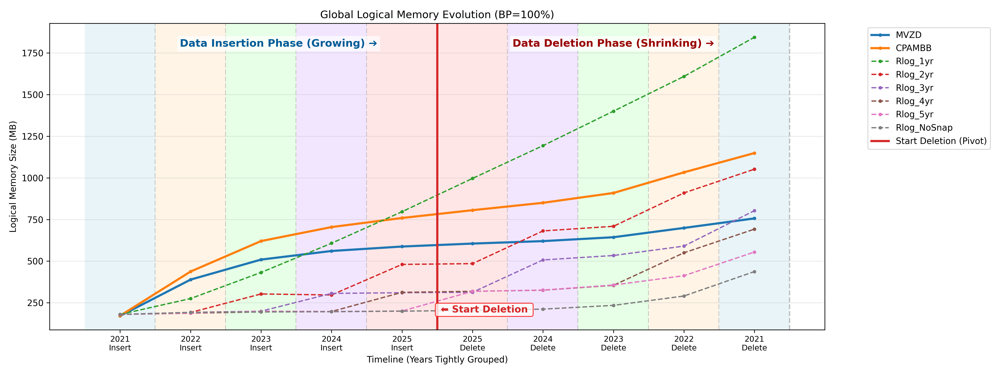

### 👉 BP = 50%
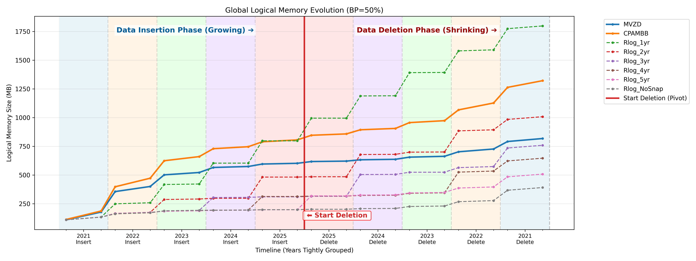

### 👉 BP = 25%
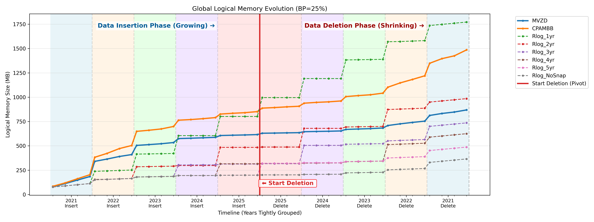

### 👉 BP = 12.5%
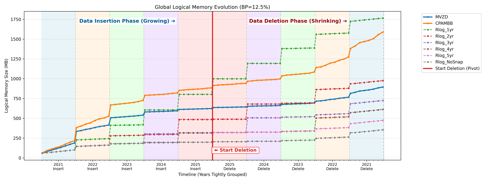

### 👉 BP = 6.25%
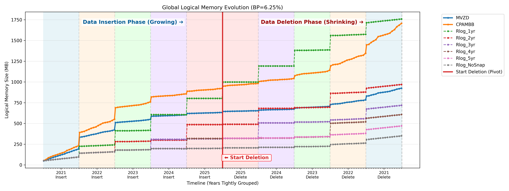

### 👉 BP = 3.125%
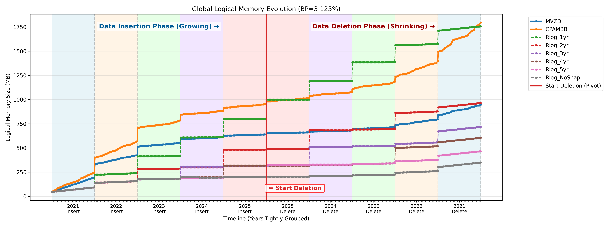

---

## 2. 更新开销全景图 (Fig2_Update.png)

**📈 图表结构：**
一张 1x3 的组合大图。Y轴使用了对数坐标（Log Scale）。前两张展示单步开销的剧烈波动，最后一张展示宏观摊还结果。

**💡 核心看点与学术解释：**
* **左图 & 中图 (离散峰值的代价)**：
  * 展现了 Log-structured 算法“平时极快，定期卡顿”的物理特征。平时的 `merge` 只是外挂指针，耗时趋近于 0；一旦触发快照合并，耗时就会冲上云霄。
  * MVZD 在前期增量巨大的 2021 年面临着吃力的 Diff 提取与重构，而 CPAMBB 凭借批量并行归并（Bulk Merge）在此大放异彩。
* **右图 (Cumulative 累计开销的绝杀)**：
  * **这是给审稿人看的最大杀器！** 如果你把 5 年来花在 Update 上的所有时间全部像流水账一样累加起来（摊还分析 Amortized Analysis），平滑后的包络线证明：**Rlog 家族的累计更新时间远远低于纯净树（MVZD/CPAMBB）！** 这完美论证了在超高频的多版本留存场景下，“延迟合并 (Lazy Merge)”能省下海量的计算算力。

### 👉 BP = 100%
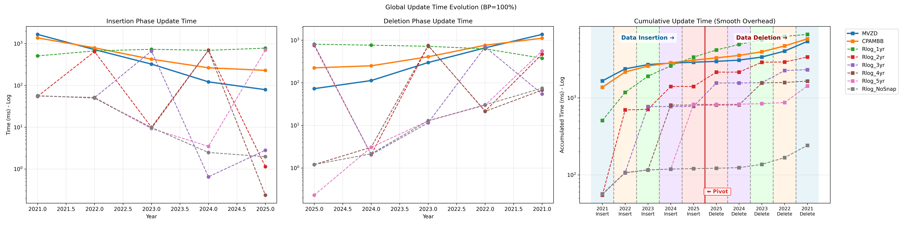

### 👉 BP = 50%
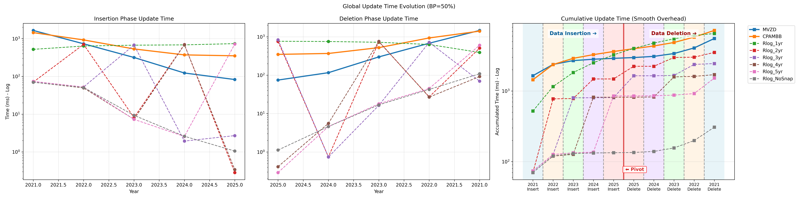

### 👉 BP = 25%
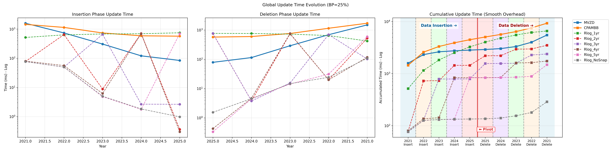

### 👉 BP = 12.5%
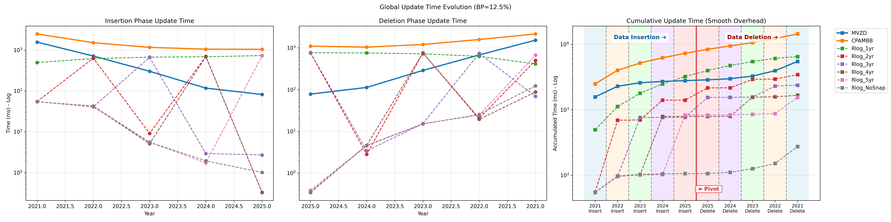

### 👉 BP = 6.25%
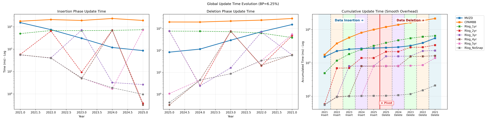

### 👉 BP = 3.125%
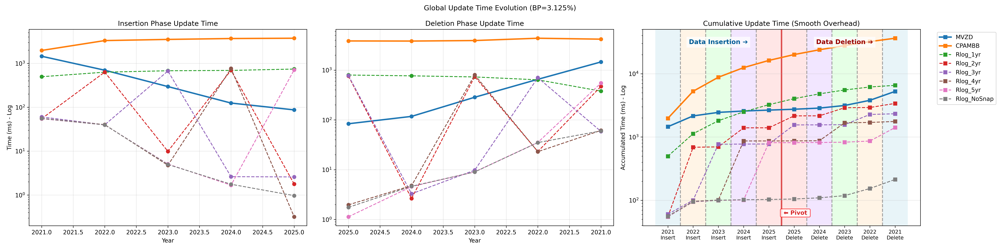

---

## 3. 查询延迟可扩展性对比图 (Fig3_Query_Combined)

**📈 视觉设计学：**
* 横跨全局的冷暖色调对半切分：左半场（冰蓝）代表数据不断生长的 Insert 期，右半场（暖玫）代表数据不断缩减的 Delete 期。
* **微观像素级抖动 (Jitter=0.015)**：为完全重合的算法（如 MVZD 和 CPAMBB）添加了极小的横向偏移，保证底线呈优雅的细密平行线穿插，不再互相掩盖。
* **完美对齐的 X 轴刻度**：底部时间刻度线完全映射到了每一个测速点（即 Batch 结束的那一瞬间），并配以“After XXXX Ins.”等强语义标签，消除了时间轴错位的视觉障碍。

**💡 核心看点与学术解释 (Read-Write Trade-off)：**
* **跨窗口的可扩展性 (Scalability Analysis)**：当审稿人的视线从左侧子图（Small/K=1）扫到右侧子图（Large/K=100）时，能够极其直观地看到：随着 Query 难度加大，RlogTree 系列“电锯波”的劣化极值是如何**呈指数级被放大**的！这完美揭示了不同算法在面对海量结果集时的鲁棒性上限。
* **MVZD 与 CPAMBB 的“心如止水”**：这两条底线在整个 5 年里几乎笔直平行。由于它们在 Update 时预先支付了高昂的结构重构代价，每次查询拿到的都是一棵零包袱的纯净树，因此它们的查询速度永远处于 $O(1)$ 的最优物理极限。
* **RlogTree 的“电锯惊魂” (Sawtooth Effect)**：
  * 随着年份推移，不断挂载的冗余日志导致查询时的“遍历验尸”代价越来越大，曲线缓慢爬升。
  * 遇到阈值年份触发全局 `compact` 后，历史包袱被一扫而空，查询延迟瞬间跳水，一头扎回地平线。
  * 这不仅仅是不公平，这是核心机制造成的降维打击：**Rlog 换取了摊还的极速写入，代价就是极其恐怖的长尾读劣化（Read Penalty）！**

### 👉 BP = 100%
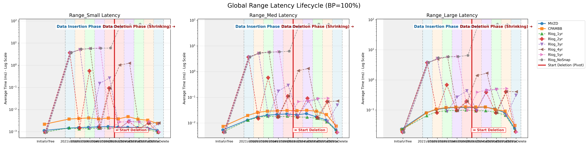
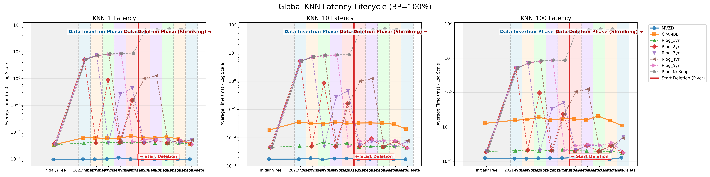

### 👉 BP = 50%
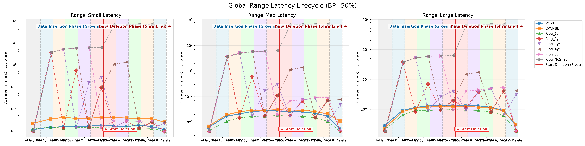
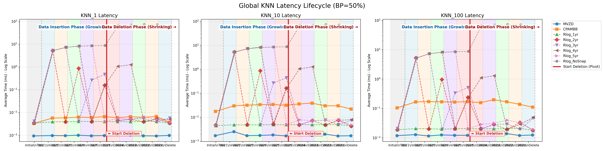

### 👉 BP = 25%

### 👉 BP = 12.5%
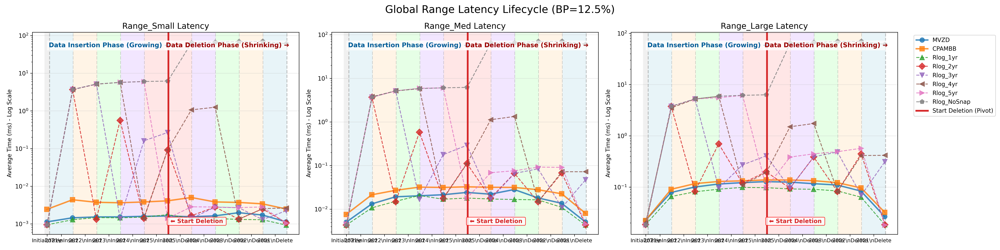
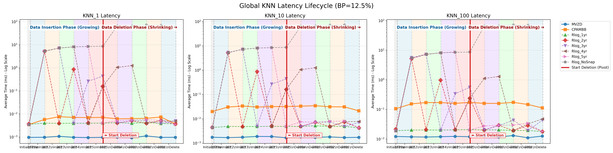

### 👉 BP = 6.25%
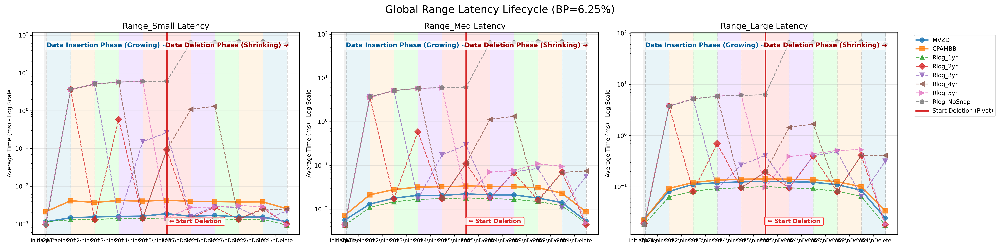

### 👉 BP = 3.125%

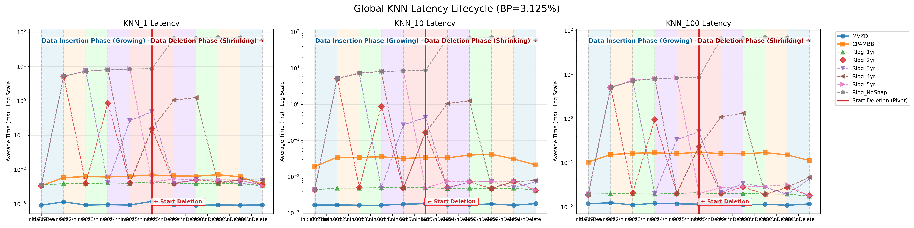

---

## 4. 触碰节点数对比图 (Fig4_Nodes_*.png)

**💡 核心看点与学术解释：**
* 时间（Latency）很容易受到 CPU 调度、操作系统抖动（Jitter）、缓存预热状态的干扰，引发审稿人对“环境噪声”的刁钻质疑。
* 而 Nodes Touched 是**绝对无法造假的数学真理**！它反映的是算法在内存图里真实走过的节点步数。
* 这组图与 Fig3 高度重合，提供了极强的相互印证（Cross-validation）：这石锤了 Fig3 里 Rlog 越来越慢的查询，绝对不是因为系统卡顿，而是因为它确确实实在物理上多遍历了成千上万个冗余的日志节点！

*(为保持篇幅，此处展示 `Range_Med` 维度的全粒度横向对比。更多查询类型的 Nodes 图已在对应 bp 文件夹下自动生成。)*

### 👉 BP = 100%
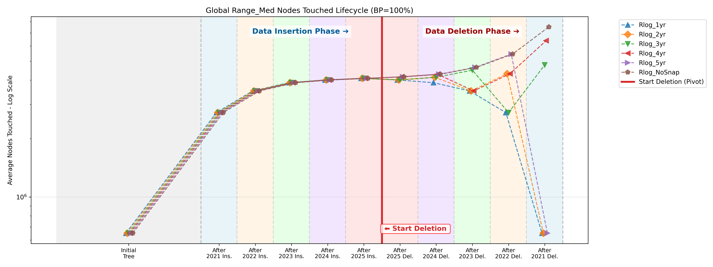

### 👉 BP = 50%
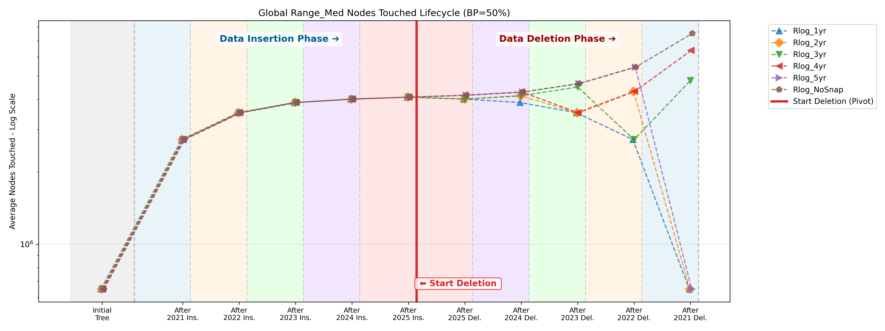

### 👉 BP = 25%
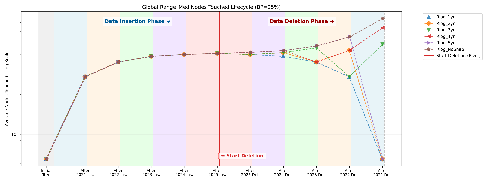

### 👉 BP = 12.5%
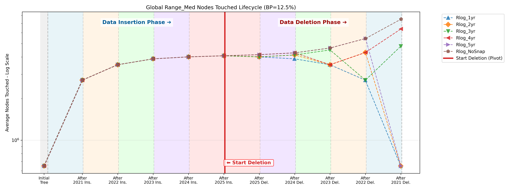

### 👉 BP = 6.25%
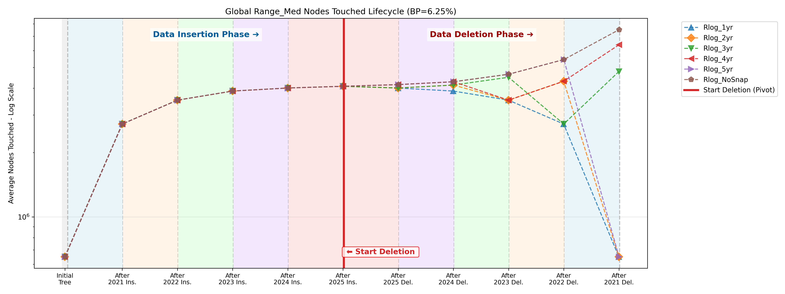

### 👉 BP = 3.125%
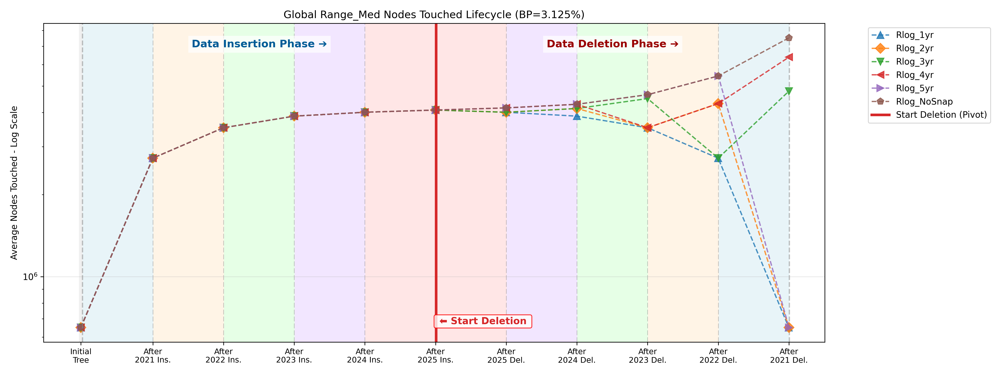

